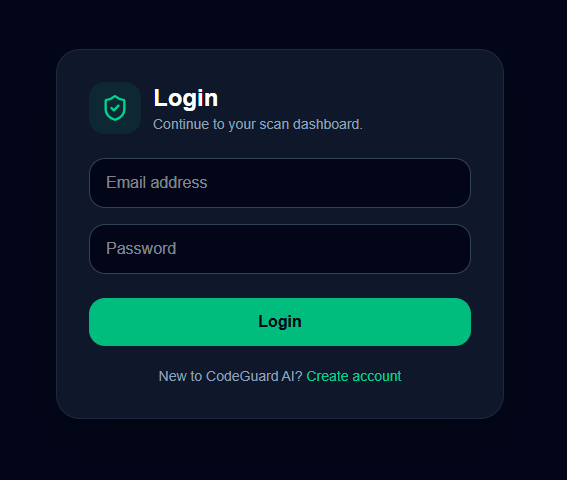
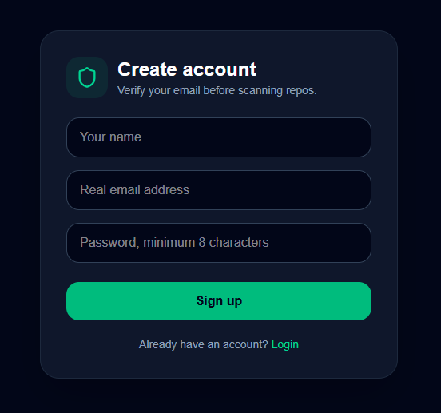
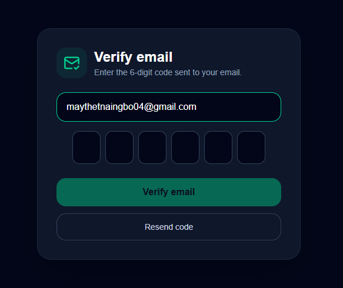
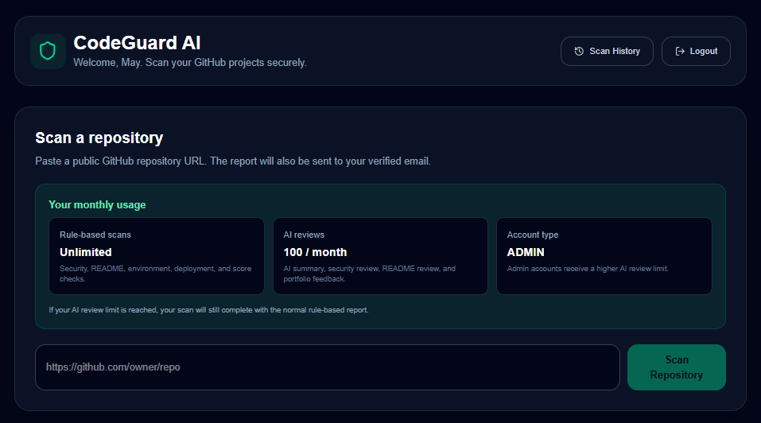
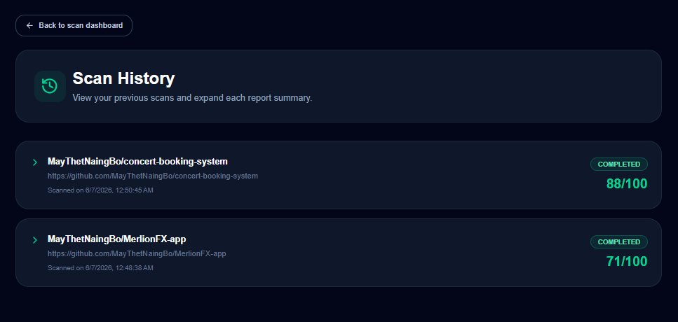
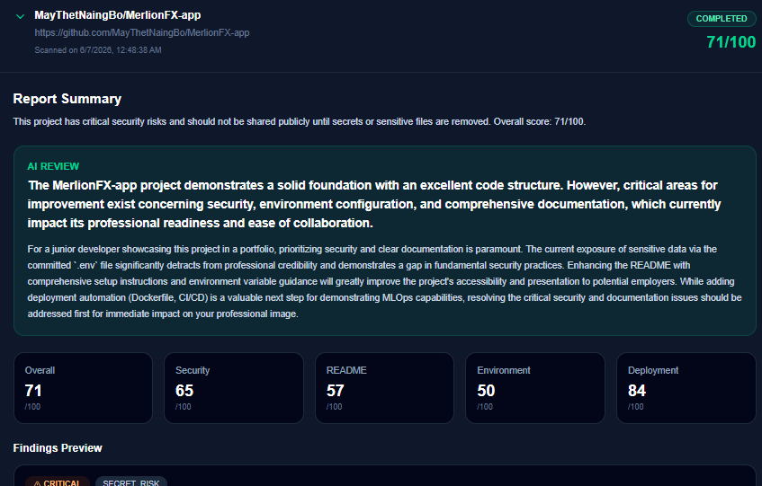
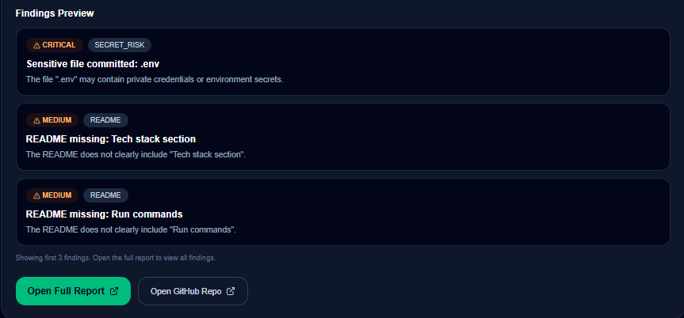
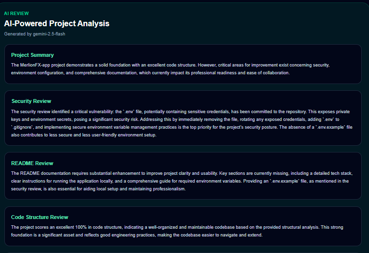
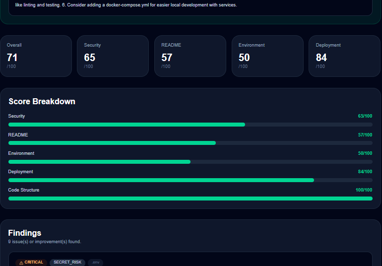
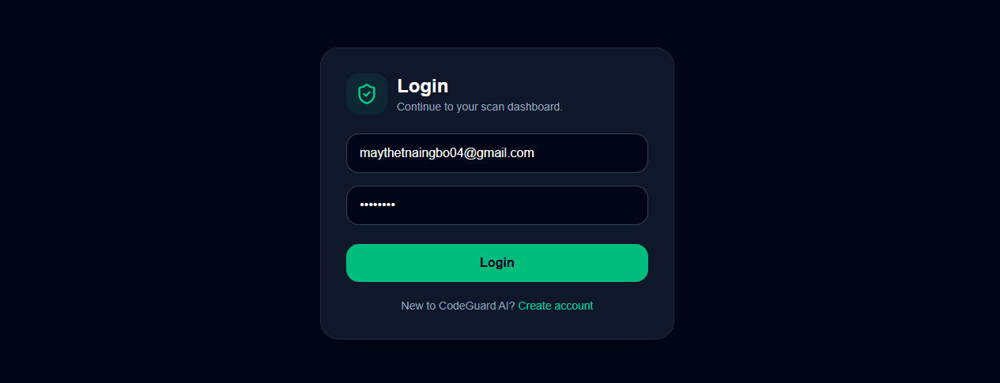

# CodeGuard AI

CodeGuard AI is an AI-driven security scanning platform that helps developers review GitHub repositories for portfolio readiness, security risks, environment configuration issues, README quality, deployment readiness, and code structure improvements.

The system allows users to create an account, verify their email, submit a public GitHub repository URL, scan the project, view detailed security findings, and receive the scan report through email.

## Features

- User registration and login
- Email verification with secure verification codes
- JWT-based authentication
- Public GitHub repository scanning
- Secret and sensitive file detection
- README quality analysis
- Environment configuration checks
- Deployment readiness checks
- Project structure and package script analysis
- Security score breakdown
- Scan history dashboard
- Detailed scan report page
- Email notification after scan completion
- PostgreSQL database with Prisma ORM
- Swagger API documentation

## Tech Stack

### Frontend

- Next.js
- React
- TypeScript
- Tailwind CSS
- Lucide React

### Backend

- NestJS
- TypeScript
- Prisma ORM
- PostgreSQL
- JWT Authentication
- Bcrypt
- Nodemailer
- Simple Git
- Swagger

### Tools

- Docker
- GitHub
- Swagger / Insomnia
- Prisma Studio

## Screenshots

### Login Page

### Sign Up Page

### Verify Email Page

### Dashboard

### Scan History

### Scan Report

## Demo

